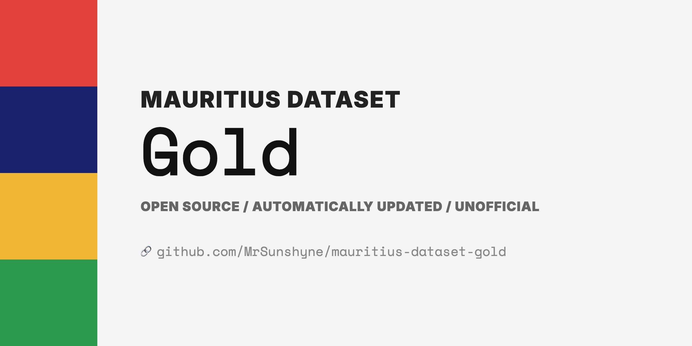

# Mauritius Gold Price Dataset

Automatically updated dataset of Mauritius gold prices, scraped daily from the [Bank of Mauritius](https://www.bom.mu/industrial-gold) website. Historical data goes back to January 2004.

Zero dependencies — uses Node.js built-in `fetch` to scrape the BOM gold price tables.

## Available Files

| File | Size | Use case |
|------|------|----------|
| [`data/current.json`](#datacurrentjson) | <1 KB | Today's price — lightweight single entry |
| [`data/timeseries.json`](#datatimeseriesjson) | ~271 KB | Charts — flat date/price arrays, oldest-first |
| [`data/index.json`](#dataindexjson) | ~3 KB | Dashboards — per-year summary stats |
| [`data/yearly/{year}.json`](#datayearlyyearjson) | ~200 KB | Drill into a specific year |
| [`data/prices.json`](#datapricesjson) | ~4.3 MB | Complete history with full detail |
| [`data/coins.json`](#datacoinsjson) | ~2.9 MB | Dodo Gold Coin prices (22K) |
| [`data/latest.json`](#datalatestjson) | <1 KB | Legacy format — raw BOM strings |
| [`data/history/{date}.json`](#datahistorydatejson) | <1 KB | Daily snapshot in legacy format |

All raw URLs follow the pattern:
```
https://raw.githubusercontent.com/MrSunshyne/mauritius-dataset-gold/main/{path}
```

---

## `data/current.json`

The most recent price entry. Use this if you only need today's gold price.

```json
{
  "date": "2026-03-20",
  "price_per_gram": 7421.58,
  "karats": {
    "24k": 7421.58,
    "22k": 6803.12,
    "21k": 6493.88,
    "18k": 5566.19
  },
  "forms": [
    { "form": "Grains", "weight_oz": 0.50, "weight_gm": 15.55, "price_per_gm": 7421.58 },
    { "form": "Grains", "weight_oz": 1.00, "weight_gm": 31.10, "price_per_gm": 7421.58 },
    { "form": "Bar", "weight_oz": 3.22, "weight_gm": 100.00, "price_per_gm": 7417.87 },
    { "form": "Bar", "weight_oz": 16.07, "weight_gm": 500.00, "price_per_gm": 7417.87 },
    { "form": "Bar", "weight_oz": 32.15, "weight_gm": 1000.00, "price_per_gm": 7417.87 }
  ]
}
```

## `data/timeseries.json`

Flat arrays optimized for charting. Dates are oldest-first for natural left-to-right plotting. Includes all karat values as parallel arrays.

```json
{
  "dates": ["2004-01-27", "2004-01-28", "2004-01-29", "..."],
  "price_per_gram": [364.47, 365.12, 366.80, "..."],
  "karats": {
    "24k": [364.47, 365.12, "..."],
    "22k": [334.10, 334.69, "..."],
    "21k": [318.91, 319.48, "..."],
    "18k": [273.35, 273.84, "..."]
  }
}
```

## `data/index.json`

Metadata and per-year summary statistics. Use this for dashboards and overview displays without loading any price data.

```json
{
  "total_entries": 5436,
  "first_date": "2004-01-27",
  "last_date": "2026-03-20",
  "generated": "2026-03-21T17:30:02.817Z",
  "years": {
    "2024": {
      "entries": 246,
      "first_date": "2024-01-03",
      "last_date": "2024-12-31",
      "open": 3089.76,
      "close": 3580.10,
      "min": 2890.50,
      "max": 3600.20,
      "avg": 3245.30,
      "change_pct": 15.87
    }
  }
}
```

## `data/yearly/{year}.json`

Full price entries for a single year (~200 KB each). Same schema as `prices.json` but filtered to one year, sorted newest-first. Available years: 2004 through present.

```
data/yearly/2024.json
data/yearly/2025.json
```

## `data/prices.json`

Complete historical dataset with all entries sorted newest-first. Same schema as `current.json` but as an array. This is the largest file (~4.3 MB) — prefer the files above for most use cases.

```json
[
  {
    "date": "2026-03-20",
    "price_per_gram": 7421.58,
    "karats": { "24k": 7421.58, "22k": 6803.12, "21k": 6493.88, "18k": 5566.19 },
    "forms": [
      { "form": "Grains", "weight_oz": 0.50, "weight_gm": 15.55, "price_per_gm": 7421.58 },
      { "form": "Bar", "weight_oz": 3.22, "weight_gm": 100.00, "price_per_gm": 7417.87 }
    ]
  },
  "..."
]
```

## `data/coins.json`

Dodo Gold Coin prices (22K) by denomination, scraped from the [BOM Gold Coins](https://www.bom.mu/gold-coins) page. Sorted newest-first.

```json
[
  {
    "date": "2026-03-20",
    "denominations": [
      { "denomination": 100, "weight_gm": 3.41, "diameter_mm": 16.50, "price": 30435.00 },
      { "denomination": 250, "weight_gm": 8.51, "diameter_mm": 22.00, "price": 72835.00 },
      { "denomination": 500, "weight_gm": 17.03, "diameter_mm": 27.00, "price": 142665.00 },
      { "denomination": 1000, "weight_gm": 34.05, "diameter_mm": 32.69, "price": 285325.00 }
    ]
  }
]
```

## `data/latest.json`

Legacy format preserving the original BOM strings exactly as scraped. Values are strings with comma formatting.

```json
[
  { "date": "20 March 2026", "form": "Grains", "weight_oz": "0.50", "weight_gm": "15.55", "price_per_gm": "7,421.58" },
  { "date": "20 March 2026", "form": "Bar", "weight_oz": "3.22", "weight_gm": "100.00", "price_per_gm": "7,417.87" }
]
```

## `data/history/{date}.json`

Daily snapshots in `YYYY-MM-DD.json` format, using the same legacy format as `latest.json`. One file per business day going back to 2004-01-27. Useful for tracking what BOM published on a specific date.

```
data/history/2024-01-03.json
data/history/2026-03-20.json
```

---

## Usage Examples

```js
// Get just today's price
const current = await fetch(
  'https://raw.githubusercontent.com/MrSunshyne/mauritius-dataset-gold/main/data/current.json'
).then(r => r.json())
console.log(`Gold: Rs ${current.price_per_gram}/gram (24K)`)
console.log(`22K: Rs ${current.karats['22k']}/gram`)

// Build a price chart
const ts = await fetch(
  'https://raw.githubusercontent.com/MrSunshyne/mauritius-dataset-gold/main/data/timeseries.json'
).then(r => r.json())
// ts.dates and ts.price_per_gram are parallel arrays, ready to plot

// Show yearly performance
const index = await fetch(
  'https://raw.githubusercontent.com/MrSunshyne/mauritius-dataset-gold/main/data/index.json'
).then(r => r.json())
for (const [year, stats] of Object.entries(index.years)) {
  console.log(`${year}: Rs ${stats.open} -> Rs ${stats.close} (${stats.change_pct}%)`)
}

// Load a single year
const data2024 = await fetch(
  'https://raw.githubusercontent.com/MrSunshyne/mauritius-dataset-gold/main/data/yearly/2024.json'
).then(r => r.json())
```

## How it works

1. Fetches the BOM industrial gold and gold coins HTML pages daily via GitHub Actions
2. Parses the price tables using regex (no browser needed)
3. Derives karat prices (22K, 21K, 18K) from the 24K reference using the standard formula
4. Generates derived views (current, timeseries, index, yearly)
5. Commits and pushes if the data changed

## Running locally

```bash
node fetch.mjs              # Scrape latest + regenerate views
node generate-views.mjs     # Regenerate views from existing data
```

## Disclaimer

This project is not affiliated with the Bank of Mauritius. Data is automatically fetched from publicly available pages at most once per day. Data is made available under fair use for informational purposes.
